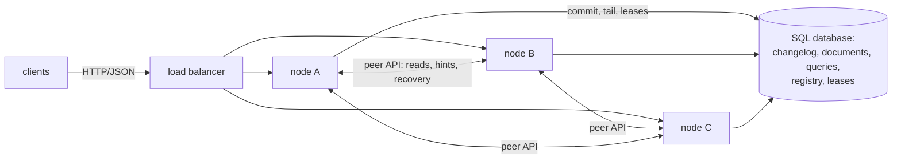
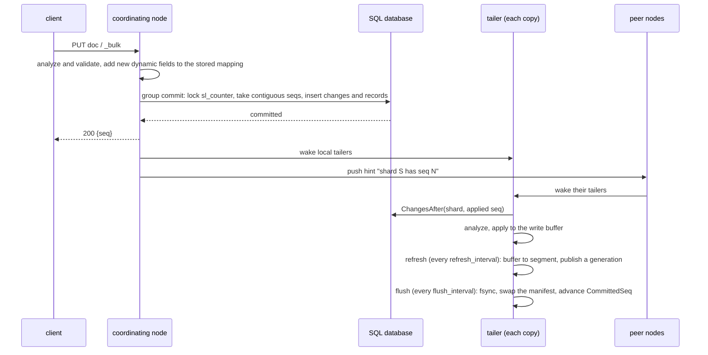
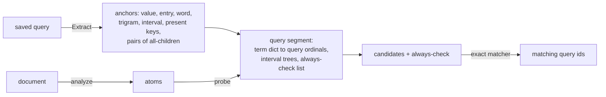

# Searchlight architecture

This is how Searchlight is built, as the code stands. The design and its reasons are in
[the spec](superpowers/specs/2026-10-02-searchlight-design.md), and the order the work is
built in is in [the plan](superpowers/plans/2026-10-02-searchlight.md).
[Planned, not built](#planned-not-built) lists what the spec promises that is not in the
code yet.

## In one paragraph

Every node of a cluster is the same binary. Each node keeps Lucene-style segments for its
shard copies on local disk and serves the whole HTTP API. Durable state lives in one SQL
database (Postgres, MySQL or SQLite), and nowhere else:

- **The changelog** (`sl_changes`) is the write-ahead log. A write is acknowledged once
  its transaction commits.
- **The documents and saved queries** (`sl_documents`, `sl_queries`) are the system of
  record.
- **The registry** (`sl_nodes`, `sl_shard_copies`) is how nodes find each other, and its
  leases decide who holds which shard copy.

Every shard copy tails its shard's changelog in sequence order, so local segments are
only a cache: they can always be rebuilt from a peer or from the database.



## Components

| Package | Role |
|---|---|
| `cmd/searchlight` | Wiring: config, telemetry and the admin listener, store, cluster node, public listener, signals and the shutdown order |
| `internal/config` | Every setting from flags, `SEARCHLIGHT_*` variables and `*_FILE` secrets, validated at start |
| `internal/api` | The public HTTP API: routing, auth, limits and backpressure, problem JSON, `refresh` and `wait_for_seq`, readiness, graceful drain |
| `internal/cluster` | `cluster.Node`, the only coordinator, a cluster of one included. It covers membership, leases and fencing, the allocator, peer recovery, routing with adaptive replica selection and retries, push hints, maintenance (pruning), cluster health and the rolling shutdown |
| `internal/node` | The engine under the cluster node: the index catalogue, the write path (analysis, mapping updates, group commit), one hosted copy and tailer per shard, reads with read-your-writes, scatter-gather and reduce |
| `internal/replica` | The tailer: keeps one shard copy in step with the changelog (recovering, tailing, halted) |
| `internal/shard` | One shard copy: write buffer, refresh into segments, generations published atomically, flush to a durable manifest, deletes sidecars, tiered merges under a node-wide budget, filter cache |
| `internal/segment` | The immutable on-disk segment format: term dictionaries, roaring postings, doc values, BKD-lite points, zstd stored fields, ids. Read through mmap and checksummed |
| `internal/search` | Planning (cost-ordered bitmap operations plus residual checks), per-segment execution, sort and `search_after`, aggregations, cross-shard reduce |
| `internal/percolate` | The reverse index of saved queries: anchor extraction, query segments, candidate generation, exact verification |
| `internal/query`, `internal/schema`, `internal/analysis` | The query language and exact matcher, mappings and document analysis, and the normalizers (byte-for-byte compatible with scrape-bot) |
| `internal/store` | The SQL store: changelog, records, catalogue, registry and leases, blobs. Its logic is written once, and each dialect (`postgres`, `mysql`, `sqlite`) owns its SQL and embedded migrations |
| `internal/telemetry` | slog JSON logs with trace ids, OpenTelemetry traces and metrics, Prometheus, pprof |
| `internal/clock` | The engine's source of time: every timer, ticker, sleep and elapsed-time reading goes through an injected `clock.Clock`, `clock.Real` in production and `clock.Fake` in tests |

Packages depend one way: `cmd → api, cluster → node → replica → shard → segment`, with
`search`, `percolate`, `query`, `schema` and `analysis` below them, and `store` beside
them.

## The write path: the SQL changelog is the WAL



1. **Validation.** The coordinating node, which is any node, analyzes and validates the
   write. If the write brings new dynamic fields, it adds them to the stored mapping
   first: the database's mapping is the one arbiter of a field's type, so every copy
   analyzes the document alike.
2. **Commit.** The changes go through the node's group committer. Concurrent requests on
   a node are coalesced into one transaction every few milliseconds, as Elasticsearch
   amortizes translog fsyncs.
   - `Apply` locks the counter row and takes contiguous seqs, then inserts the change
     rows and the document or query rows, and commits.
   - Commit order therefore equals seq order, and a tailer never skips a change that
     commits late.
   - The write is acknowledged with its seq only after the commit.
3. **Wake-up.** The node never writes a shard itself. It wakes its own tailers, and the
   cluster pushes a hint to the peers holding copies of the written shards.
   - On Postgres, `LISTEN/NOTIFY` also wakes every tailer.
   - Polling every `changelog_poll_interval` is the safety net everywhere.
4. **Apply.** Each copy's tailer reads `ChangesAfter(shard, appliedSeq)`, analyzes the
   changes and applies them to the shard's write buffer. Seqs are global, so a shard
   sees gaps. A short page proves that nothing below the head is missing, and the copy
   advances past the gap.
5. **Refresh is visibility.** Refreshes tick on a fixed grid, every `refresh_interval`
   from the copy's open, so a refresh's own cost never stretches the period. One that
   overruns skips the ticks it missed. `refresh=true` forces one at once, and a full
   buffer (64 MiB) starts one early.
   - The buffer becomes an immutable segment, written without fsync. The deletes it
     masks stay in memory.
   - The new generation (the list of segments) is published through an
     `atomic.Pointer`, and readers never lock.
   - `refresh=wait_for` waits for the first published generation that covers the write;
     it never forces a refresh, and never waits for durability.
6. **Flush is durability.** A flush runs every `flush_interval` (10 s), at shutdown, at
   every merge commit and before a peer snapshot.
   - It fsyncs the segment files no flush has synced, and writes and fsyncs the deletes
     sidecars.
   - It swaps the manifest, the copy's commit point, atomically: temp file, fsync,
     rename, directory fsync.
   - Only then does it advance `CommittedSeq` to the manifest's seq. The copy reports
     that as its applied seq, and the changelog is never pruned past it. So
     `CommittedSeq` only ever claims what is on disk.
   - A failed fsync is never retried: after a write-back error a later fsync can
     succeed over lost pages. It fails the copy, which reopens from its last flushed
     manifest.

There is no per-node translog: the SQL changelog is the write-ahead log, so nothing a
copy publishes needs to be durable on the copy first. After a crash, a copy reopens the
segments of its last flushed manifest and replays the changelog from that manifest's
seq, which is at most `flush_interval` of changes.

### Shards and segments

```
data_dir/
  indexes/<index uid>/<shard>/      one shard copy's root
    manifest                        SLMANIFEST header + JSON: gen, seq, segments, query_segments
    <segment id>.seg                immutable, mmap'd, CRC32C per section and whole file
    <segment id>.<gen>.del          deletes sidecar of a generation (the segment is never rewritten)
    CURRENT, copy-<n>/              an aside rebuild: the new copy is built in a subdirectory
                                    and made current by rewriting CURRENT atomically
  recovery/<index>.<shard>/         peer recovery staging
```

- **Updates and deletes** mark older segments' documents dead in a per-generation
  sidecar. An id the buffer touched masks every older version of it at the same refresh
  that publishes the new one, so no reader ever sees two live versions of an id.
- **Merges** follow a tiered policy, like Lucene's. A merge writes a new segment,
  publishes it, then flushes, so its manifest never lists an unsynced file. Merges run in
  the background and share a node-wide budget: `merge_threads` for CPU and
  `merge_budget` bytes per second for I/O. Deleted documents are dropped as segments
  merge.
- **Files are removed** only once no durable manifest lists them. A sidecar goes at the
  first flush whose manifest drops it. A merged-away segment goes once that flush has
  run and the last reader has released it. Open removes whatever a crash left that the
  manifest does not list.
- **Caches.** The filter cache keeps per-segment bitmaps of frequent leaves, and needs no
  invalidation because segments are immutable. The OS page cache holds the mmap'd
  files.
- **Format versions.** The segment format is versioned (major 3). A node refuses a
  segment whose major it does not know, and a bad checksum makes the copy recover rather
  than serve it: a copy whose files do not open is wiped and rebuilt like a new one.

### Search

1. **Plan.** The planner normalizes the query and orders its leaves by cost, from
   per-segment term statistics.
   - Leaves that a bitmap can answer become roaring operations: `all` intersects
     smallest first, `any` unions, and `not` complements against the live documents.
   - The rest become residual checks over doc values: `contains` behind a trigram
     prefilter, `similar` behind trigram candidates, and ranges served by points.
2. **Execute.** Segments are searched in parallel on the `search_threads` pool. Each one
   produces hits, a top-k for the sort, and partial aggregations.
3. **Reduce.** Results reduce across segments, then across shards on the coordinator.
   With several shards, the query phase runs without bodies, and only the winning hits'
   bodies are fetched. The copy pins its generation between the two phases (a peer for
   `PinTTL`, 30 s).

### Percolator



- **Anchors.** Each saved query is reduced to anchors: atoms at least one of which every
  matching document must hold. Queries that cannot be anchored (`not`, `ne`,
  `exists:false`, `empty`, the match-all root) go on the always-check list.
- **Query segments.** Anchors live in percolator segments that refresh and merge like
  document segments.
- **Percolating a document.** The document becomes atoms, which probe the query index
  for candidates. The always-check list is added, and every candidate is verified with
  the exact matcher. The answer is therefore exactly the brute-force one, and a property
  test checks that the candidates always include every true match.

## The cluster

### Membership, leases and fencing

- **Membership.** A node registers in `sl_nodes` and heartbeats every 2 s. A node silent
  for 10 s is dead. Peers are discovered from the same table, so a node needs only
  `store_url`, plus `advertise_address` when its listen address is not what peers dial.
- **Slots and epochs.** Each shard copy is a slot in `sl_shard_copies`, held under a
  lease (`lease_ttl`: 10 s, or 30 s on SQLite) with a **fencing epoch** taken from a
  database counter at each claim. Every registry write a copy makes is conditional on
  its slot, node and epoch, so a node that lost its lease gets `ErrLeaseLost` and can
  never overwrite its successor.
- **Local deadline.** The node renews its leases on the heartbeat tick. It keeps a local
  deadline per copy on its own monotonic clock, measured from just before each renewal.
  Past the deadline, less a margin, the copy stops serving and its tailer stops, before
  any other node can claim the slot.
- **Allocation.** Every node runs the allocator. A shard below its copy target
  (`replicas_per_shard`; by default every node holds every shard) is claimed by an
  eligible node with a conditional insert or update: one without a copy of that shard,
  with spare capacity, least loaded first. When a target is lowered, the extra slots are
  released.
- **Copy states.** A copy is `recovering`, `serving` or `retiring` in the registry.
  Locally it can also be `halted` (see [operations](operations.md#troubleshooting)).

```mermaid
stateDiagram-v2
  [*] --> recovering: claim (new epoch)
  recovering --> serving: snapshot fetched, changelog replayed
  serving --> recovering: halted at a change, corrupt segment, pruned past
  serving --> retiring: drain / stop
  retiring --> recovering: same node restarts, reclaims at the same epoch
  serving --> [*]: lease expires (node died); others claim
```



### Peer recovery

A copy that must be built, whether new, wiped, pruned past or corrupt:

1. **Snapshot.** The tailer asks a serving peer for a snapshot. It picks the best peer
   first, by adaptive replica selection. The peer flushes first, then pins the
   generation that flush made durable, so it never hands out a seq it could itself lose.
   It lists that generation's files with their sizes and SHA-256 sums: segments,
   deletes sidecars and a manifest.
2. **Staging.** Each file is streamed into `data_dir/recovery/…` as `name.part` and
   checked against its sum, then renamed and fsynced.
   - An interrupted transfer resumes with an HTTP Range request.
   - A file already staged with the right sum, even by an attempt against another peer,
     is not fetched again.
   - A stream idle for 30 s is cut, and resumed.
3. **Commit.** The files move into the copy's empty directory, and the manifest is
   written last, as the commit point. A recovery cut short anywhere before the manifest
   leaves a directory that opens empty.
4. **Catch-up.** The tailer opens the copy and replays the changelog from the snapshot's
   seq, and the copy turns `serving`.

When no peer can serve, the newest **recovery bundle** of the shard is restored
instead, if `bundle_interval` uploads them:

- **Upload.** Every `bundle_interval`, the serving copy of each shard on the live node
  with the lowest id flushes and streams its durable generation into one blob in
  `sl_blobs` (`bundles/<index>/<incarnation>/<shard>/<seq>`): a header listing every
  file's name, size and SHA-256, the manifest last, then the files. The blob store
  chunks it and sums it. An upload whose commit's outcome is unknown counts only when
  `Stat` shows the stored sum is the one streamed. The oldest bundles past
  `bundle_retention` are then deleted.
- **Restore.** The newest bundle the changelog still reaches is staged under
  `data_dir/recovery/…/bundle`, every file checked against its sum and fsynced, and the
  blob's own sum checked at its end. Only then are the files moved into the copy's
  directory and the manifest written last. A bundle failing any check is never
  installed; the next older one is tried.

When neither a peer nor a bundle serves, or any step fails, the copy is rebuilt from the
database instead: `ScanShard` streams the shard's current rows as of a seq, and the
changelog is replayed from there. A copy that is outdated but still valid is rebuilt
aside, so it keeps serving until its replacement catches up.

### Routing

Any node takes any request.

- **Writes** go to SQL first, the commit point (see the write path above).
- **Reads** use this node's copy when it is serving and current. Otherwise they go to a
  serving copy elsewhere whose lag is within `max_lag`, chosen by adaptive replica
  selection on measured latency, like Elasticsearch's ARS. A failed or timed-out attempt
  (10 s) is retried on another copy, so with two or more copies, one node failing is not
  a client error.
- **Peer traffic** (reads, hints, snapshots) uses the internal API under `/_internal/` on
  the same listener. It is authenticated by `cluster_token`, and runs over TLS when
  `tls_cert` is set, with peers verified against `peer_ca_file`.

### Rolling restarts

On SIGTERM, a node:

1. turns readiness false;
2. retires each copy that a serving copy elsewhere can stand in for. It stops the copy's
   tailer and marks it `retiring`, and the database checks atomically that another copy
   still serves, so nodes draining together never retire a shard's last serving copy;
3. keeps serving for `shutdown_grace`, then drains its listener;
4. stops its remaining copies, writing their final manifests;
5. deregisters.

The leases are not released: the rows stay `retiring` at their final applied seqs.
Pruning keeps the changelog the node needs for `retiring_retention` (15 min). When the
node comes back, it reclaims its own slots at the same epochs, reopens its segments and
replays only the tail. Restart time does not grow with index size.

### Changelog pruning and maintenance

The live node with the lowest id is the leader. No election is needed, because its jobs
are idempotent. The leader:

- prunes each shard's changelog below the lowest applied seq of the copies that count.
  A copy's applied seq is its `CommittedSeq`, what its last flush made durable;
- sweeps abandoned blob uploads.

The copies and recovery points that count are:

- the live copies, a recovering copy holding its slot at seq 0 included;
- a cleanly stopped node's retiring copies, for `retiring_retention` after their leases
  ran out;
- every retained recovery bundle of the shard's current incarnation, at its seq.

The floor is bounded, so no copy can hold it forever:

- a copy behind the others that makes no progress for `prune_stall_timeout` stops
  counting;
- a change older than `changelog_retention` is pruned whatever still needs it, and a
  bundle it prunes past is deleted.

A copy pruned past rebuilds from a peer or the database. The leader also deletes the
bundles of dropped indexes. Every node also collects its own
unused copy directories and stale recovery staging.

## The binary's lifecycle

```mermaid
sequenceDiagram
  participant M as main
  participant Adm as admin listener :8781
  participant St as store
  participant N as cluster.Node
  participant Api as public listener :8780
  M->>Adm: telemetry, then serve /healthz, /readyz (503 until the API exists), /metrics, pprof
  M->>St: open, migrate (under a lock), retried with backoff while unreachable
  M->>N: cluster.New (engine opens the catalogue)
  M->>Api: serve Node.Handler(API) before Start: peers may call at once
  M->>N: Start: register, read registry, SQLite single-node check, allocate, loops
  Note over M: SIGINT / SIGTERM fixes deadline D = now + shutdown_grace + T
  M->>Api: readiness false; Drain retires covered copies (T/4); serve for shutdown_grace
  M->>Api: stop accepting, finish in-flight requests (T/4)
  M->>N: Stop: final manifests, rows retiring, deregister (until D - T/10)
  M->>St: close
  M->>Adm: close
  M->>M: telemetry flush, exit 0
```

The whole shutdown fits one budget, fixed at the signal: `shutdown_grace` plus
`shutdown_timeout` (T). The drain and the listener get T/4 each, the node's stop runs
until T/10 before the deadline (at least 0.4 T), and the store, the admin listener and
telemetry close in the last T/10. A second signal ends the process at once. A signal
during startup stops the node cleanly too, with exit code 0.

## Time: the injectable clock

Every timer, ticker, sleep and elapsed-time reading in the engine goes through an
injected `clock.Clock` (`internal/clock`). That covers shard refreshes and flushes,
replica polling and backoff, cluster heartbeats, leases and maintenance, the group-commit
window, the API's request timing and its shutdown grace.

- **Production.** `clock.Real` runs everything. `cmd/searchlight` passes it to the store,
  the cluster node (which hands it to the engine) and the API.
- **Tests.** They drive a `clock.Fake`, advancing it instead of waiting.
- **Monotonic and wall time.** Durations use the monotonic reading, so a stepped wall
  clock never stretches a measured interval. Lease validity also checks the wall clock,
  which keeps running while a machine is suspended.
- **Enforcement.** A forbidigo rule in `.golangci.yml` forbids direct `time.Now`,
  `time.After`, timers and sleeps in the engine's production packages: `shard`,
  `replica`, `cluster`, `store`, `node` and `api`.
- **Refresh scheduling.** Refreshes run on a fixed grid of this clock (`clock.GridLoop`).

## Planned, not built

- **Tuning against Elasticsearch** (plan Task 14). The benchmark harness is in `bench/`
  (it runs the real binary, restarts and recoveries included) and the chaos suite in
  `test/chaos`, but the tuning until every spec §1 target is met is still to come.
  `docs/benchmarks.md` will hold the results.
