# Clustering on Postgres

How a Searchlight cluster works: what is durable, what is a cache, how a write gets
acknowledged and becomes visible, how a node joins and leaves, and what happens when a
node, the network or the database fails. For what to run and where, see
[operations.md](operations.md#deploy). For the component-level detail (packages, the
write path, the segment format), see [architecture.md](architecture.md). The design and
its reasons are in [the spec](superpowers/specs/2026-10-02-searchlight-design.md)
(§2, §8, §9, §10).

For nginx as the load balancer in front of the cluster, see [nginx.md](nginx.md).

- [The model](#the-model)
- [Joining](#joining)
- [Writes](#writes)
- [Reads](#reads)
- [Shards and copies](#shards-and-copies)
- [A new or replaced node](#a-new-or-replaced-node)
- [Failures](#failures)
- [Postgres sizing and settings](#postgres-sizing-and-settings)
- [Rolling restarts and upgrades](#rolling-restarts-and-upgrades)
- [SQLite and MySQL notes](#sqlite-and-mysql-notes)

## The model

**There is no "query agent" role to deploy.** Every node is the same binary, and every
node can coordinate a request: the node nginx (or any load balancer) happens to send a
request to is, for the life of that request, its "query agent". It routes the request to
the right shard, commits writes to Postgres, and scatters a search to one copy of each
shard before gathering the results. There is nothing to configure to make a node a
coordinator, and nothing that stops one from being one (spec §1, §2).

```
clients ──HTTP/JSON──► nginx ──► any node (that node is now the "query agent")
                                   │ routes by shard, scatter-gathers searches
                       ┌───────────┼───────────────┐
                     node A      node B          node C      each holds a set of
                       │  segments on local disk (mmap)       shard copies
                       │  in-memory write buffer, tails the changelog
                       └───────────┴───────────────┴──────► Postgres
                                 sl_changes, sl_documents, sl_queries,
                                 sl_nodes, sl_shard_copies, sl_blobs
```

**Postgres is the write-ahead log and the system of record. A node's local disk is a
cache that can always be rebuilt.** A write is acknowledged once its transaction commits
to Postgres; nothing on a node's disk needs to be durable before that happens. A shard
copy's segments are a materialized view of the changelog, kept locally for speed. That
is why:

- **there is no consensus service.** The spec's "no ZooKeeper, no etcd, no consensus
  library" (§1) follows directly from putting the write-ahead log, the sequence counter
  and the shard registry in the one database every node already talks to. A `seq`,
  taken under a locked row (`sl_counter`), is the only ordering primitive the cluster
  needs; no node has to agree with another about anything that isn't already a row in
  Postgres;
- **losing a node's disk loses nothing.** A node whose `data_dir` is gone just looks,
  to the rest of the cluster, like a node with zero shard copies. It recovers every
  copy from a peer, a recovery bundle, or Postgres itself (see
  [A new or replaced node](#a-new-or-replaced-node)), and nothing it had on disk was
  ever the only copy of anything.

### What lives in which table

| Table | Holds | Role |
|---|---|---|
| `sl_changes` | One row per committed change: `seq`, index, shard, kind, id, payload, time | The write-ahead log. Every shard copy tails this in `seq` order; it is the only thing that has to happen before a write is acknowledged |
| `sl_documents` | The current body and `seq` of every live document, by index/shard/id | The system of record for documents. A `GET` of one document reads this table directly (it is realtime), not a segment |
| `sl_nodes` | node_id, address, version, heartbeat time, capacity | The membership registry: how a node discovers its peers, and how the cluster tells a live node from a dead one |
| `sl_shard_copies` | index, shard, node_id, state (`recovering`/`serving`/`retiring`), `applied_seq`, `lease_until` | The allocator's bookkeeping: which node holds which shard copy, under what lease, and whether it is caught up |
| `sl_blobs` | Optional, checksummed recovery bundles of a shard's durable segments | A faster path than re-scanning the database when no peer can serve a recovery (off by default; `bundle_interval`) |

`sl_queries` is `sl_documents`' counterpart for saved queries, and `sl_indexes` holds
each index's mapping and settings; neither changes the picture above. `sl_counter` is
the single row every `Apply` locks to hand out contiguous `seq` values (spec §8).

## Joining

A node needs exactly one setting: **`store_url`**. Everything else about membership is
automatic (spec §9, operations.md's [configuration table](operations.md#every-setting)):

- **`advertise_address`** is the `host:port` other nodes dial to reach this one. Set it
  when `listen` is not what peers should use to reach the node — behind NAT, or in
  Compose/Kubernetes where the node's own hostname is what peers resolve (see
  `deploy/compose.yml`'s `SEARCHLIGHT_ADVERTISE_ADDRESS` and
  [Internal peer traffic](nginx.md#internal-peer-traffic)).
- **`cluster_token`** authenticates the internal peer API (`/_internal/` on the public
  listener). Without it, a cluster of more than one node cannot form: peer calls (reads,
  push hints, recovery snapshots) are refused.

On start, a node inserts or updates its row in `sl_nodes` and heartbeats every 2 s.
Peers are discovered by reading that same table — there is no separate discovery
mechanism, gossip protocol or seed list. **A node silent for 10 s is dead**: its leases
expire (see [Shards and copies](#shards-and-copies)) and other nodes claim its shards.
That 10 s is fixed, not a setting; what is tunable is `lease_ttl` (how long a lease
survives without a renewal: 10 s by default, 30 s on SQLite) and the 2 s heartbeat
interval is likewise fixed.

A node joining for the first time registers, reads the registry to find its peers,
and starts its allocator loop; it has no shards until the allocator claims some for it.
`GET /readyz` turns 200 once every shard copy the allocator has given this node has
finished recovering (operations.md's [Deploy](operations.md#deploy) section).

## Writes

```mermaid
sequenceDiagram
  participant Cl as client
  participant Co as coordinating node (any node)
  participant DB as Postgres
  participant T as tailers (every copy, incl. Co's own)
  Cl->>Co: PUT doc / _bulk
  Co->>DB: group commit: lock sl_counter, take contiguous seqs, insert, commit
  DB-->>Co: committed
  Co-->>Cl: 200 {"seq": N}
  Co->>T: wake its own tailers (fast path)
  Co->>T: push hint "shard S has seq N" to peers holding S
  Note over DB,T: Postgres LISTEN/NOTIFY also wakes every tailer; polling is the safety net everywhere
  T->>DB: ChangesAfter(shard, applied_seq)
  T->>T: apply, then refresh (visible) and flush (durable) on their own clocks
```

- **Any node commits any write.** The coordinator locks the `sl_counter` row, takes
  contiguous `seq` values for the batch, inserts the change rows and the document or
  query rows, and commits in one transaction. Concurrent writes on the same node are
  coalesced into that one transaction every 2 ms or at 1,000 changes, whichever comes first (**group commit**), the way
  Elasticsearch amortizes translog fsyncs — so `_bulk` is the throughput path, not many
  small single-document writes (spec §8).
- **The write is acknowledged with its `seq` only after the commit.** That `seq` is a
  receipt: pass it back on a later read as `?wait_for_seq=N` for read-your-writes (see
  below), or hold onto it for `if_seq` optimistic concurrency.
- **Fast path.** The coordinator never writes a shard directly; it wakes its own
  tailers, which is normally the quickest way any copy of a shard it holds sees the new
  change.
- **Push hint + LISTEN/NOTIFY.** The coordinator also pushes a "shard S has seq N" hint
  over the internal peer API to every other node holding a copy of an affected shard,
  which wakes their tailers immediately rather than waiting for the next poll. On
  Postgres, `LISTEN/NOTIFY` wakes every tailer too (the payload is sent inside the same
  commit, so it never arrives before the row it announces is visible).
- **Polling is the safety net everywhere**, including on dialects with no
  `LISTEN/NOTIFY` (MySQL): every `changelog_poll_interval` (500 ms by default), a
  tailer with nothing to do checks `ChangesAfter` anyway. A missed hint or a dropped
  notification costs at most one poll interval, not a stuck copy.
- **Write-to-visible timing.** A write becomes searchable on a given copy at that copy's
  next **refresh** (every `refresh_interval`, 1 s by default, on top of however long the
  hint/notify/poll took to wake its tailer and apply the change — normally well under a
  second). Three knobs on the request itself change this:
  - nothing special: visible everywhere within `refresh_interval` of the commit;
  - `?refresh=wait_for`: the response waits until the write is searchable on the
    **coordinator's own copy** specifically (it never forces an early refresh, and never
    waits for durability — refresh and flush are separate, see
    [architecture.md](architecture.md#the-write-path-the-sql-changelog-is-the-wal));
  - `?refresh=true`: forces a refresh of the written shard at once, at the cost of a
    small segment per call — don't do this per document under load.
- **Read-your-writes with `wait_for_seq`.** Any read (`_search`, `_count`,
  `_percolate`, `_fields`, `GET` of a document or query) takes `?wait_for_seq=N`. It
  waits, under the request's deadline, until the copies it actually reads have applied
  every change up to `N` — which may be a different copy than the one that took the
  write. An `N` past the newest seq the node knows is a 400; if the database cannot be
  reached to confirm it, it is a 503 `unavailable` with `Retry-After` (see
  [api.md](api.md#consistency)). `GET` of a single document or saved query is simpler
  still: it reads `sl_documents`/`sl_queries` directly, so `wait_for_seq` is trivially
  satisfied (there is no "applying" to wait for).

## Reads

Any node answers any search, count, percolation or field-catalogue request, local or
not:

1. **Local copy first.** If this node already holds a serving, current copy of a
   shard, it is used — no network hop, no routing decision.
2. **Otherwise, the least-loaded serving copy within `max_lag`.** The coordinator
   scores the serving copies of a shard it doesn't hold by measured latency —
   **adaptive replica selection (ARS)**, the same idea as Elasticsearch's — and picks
   among those whose lag is within `max_lag` (2 s by default). A copy further behind
   than that is not offered as a read target at all.
3. **Scatter-gather across shards.** A search touching more than one shard fans out to
   one copy per shard in parallel and reduces the results on the coordinator (cross-
   shard sort, aggregation merge, paging).
4. **Retries on another copy.** A failed or timed-out attempt (a fixed 10 s internal
   budget) against a chosen copy is retried against another serving copy of the same
   shard, not surfaced to the client. With two or more copies of every shard, one node
   failing is not a client-visible error (architecture.md's
   [Routing](architecture.md#routing)).

## Shards and copies

**The allocator runs on every node and needs no leader election.** For each shard below
its target copy count (`replicas_per_shard`; **0, the default, means every node holds
every shard**), an eligible node — one that doesn't already hold a copy of that shard,
has spare capacity, and is the least loaded candidate — claims a copy row in
`sl_shard_copies` with a conditional insert or update. That claim renews with the
node's heartbeat.

- **Why every node holds every shard by default.** It's the simplest thing that works:
  any node can serve any read locally, with no routing decision at all for a
  single-shard index. Set a lower `replicas_per_shard` on a large index so its shards
  don't all have to fit on every node; the coordinator then scatters reads to whichever
  nodes actually hold a copy.
- **Leases and epochs, in operator terms.** Each shard copy is held under a lease
  (`lease_ttl`), stamped with a fencing epoch taken from a database counter at the
  moment it was claimed. Every write a copy makes to its own row is conditional on
  "I still hold this slot, at this epoch" — so a node that loses its lease (it was too
  slow to renew, or GC-paused, or partitioned) can never silently overwrite what its
  successor has already done to that slot. What you see in `GET /_cluster/shards` is
  the `state` (`recovering`, `serving`, `retiring`) and `applied_seq`/`lag`, not the
  epoch itself — the epoch is bookkeeping that keeps two nodes from fighting over the
  same shard copy, not something you act on day to day.
- **Quarantine, in operator terms.** A copy that meets a change it cannot apply
  (`halted`) stops serving reads and is marked `recovering` rather than being left
  silently wrong; a copy whose on-disk files fail their checks (a bad checksum, a
  missing file) is wiped and rebuilt rather than served. In both cases the shard keeps
  serving from its other copies, and `GET /_cluster/health` turns `yellow` (target not
  met) rather than `red` (no serving copy) as long as one copy is still up. See
  operations.md's [Troubleshooting](operations.md#troubleshooting) for what each state
  means and what to do about it — this is the same material, from the allocator's side.

```mermaid
stateDiagram-v2
  [*] --> recovering: claimed (new epoch)
  recovering --> serving: caught up to the changelog
  serving --> recovering: halted, corrupt, or pruned past
  serving --> retiring: drain / rolling restart
  retiring --> recovering: same node restarts, reclaims at the same epoch
  serving --> [*]: lease expires (node died); another node claims it
```



## A new or replaced node

A copy that must be built — a brand-new node, a wiped disk, a copy pruned past, a
corrupt segment — goes through the same steps whether it is new or just replacing
itself:

1. **Peer recovery.** It asks a serving peer (chosen by ARS) for its current durable
   generation: the peer flushes first, then streams a checksummed, resumable copy of
   every segment, deletes sidecar and the manifest. An interrupted transfer resumes
   with an HTTP Range request rather than starting over.
2. **The bundle (`sl_blobs`), if no peer can serve it.** With `bundle_interval` set,
   the newest recovery bundle of the shard that the retained changelog still reaches is
   restored instead — faster than rebuilding from documents, at the cost of database
   space (see operations.md's [Recovery bundles](operations.md#recovery-bundles)). This
   is skipped entirely when `bundle_interval` is `0s` (off, the default).
3. **`ScanShard`, as the last resort.** With neither a peer nor a usable bundle, the
   copy is rebuilt from `sl_documents`/`sl_queries` directly: every current row of the
   shard is scanned and re-analyzed as of a seq.
4. **Changelog replay.** Whichever of the above the copy started from, it replays
   `sl_changes` from that point's seq forward, and only then turns `serving`.

**How long this takes.** There is no single number: it is the file-copy phase (bounded
by the slower of disk and network, since whole segments are streamed) plus however much
changelog has to be replayed since the snapshot's seq (normally small off a healthy
peer; much larger off `ScanShard`, which starts from scratch). The benchmark harness
(`bench/`) measures recovery time against Elasticsearch's peer recovery as one of its
workloads, but the tuning pass to hit the spec's targets is still ahead of this doc (see
[architecture.md's "Planned, not built"](architecture.md#planned-not-built)) — don't
take a number from here, watch the actual run instead:
`searchlight_replica_recovery_progress_ratio`, `searchlight_replica_recovery_bytes_total`
(by `source`: `peer`, `blob`, `sql`) and `searchlight_replica_recovery_duration_seconds`
(operations.md's [Monitoring](operations.md#monitoring)).

An **aside rebuild** (an existing, still-valid-but-outdated copy being replaced) keeps
serving its old copy until the new one catches up, so a shard already at its replica
target doesn't drop below it just because one copy is being rebuilt.

## Failures

| Failure | What happens |
|---|---|
| **A node dies** (crashes, is killed, loses power) | Its heartbeat stops. After 10 s its leases expire, and the allocator on other nodes claims its shards up to the target copy count. Reads and writes against the shards it held see no client error as long as ≥ 2 copies existed. |
| **A network partition** | The cut-off node's copies stop serving *before* another node takes over, not after: each copy tracks its own lease deadline on its own monotonic clock from just before each renewal, and stops serving (and stops its tailer) at that local deadline, independently of whether it can reach the registry to confirm it lost the lease. A node on the wrong side of a partition therefore can't keep answering reads with a stale view of "I still hold this" after another node has legitimately claimed the slot. |
| **Postgres is down** | Writes return 503 `unavailable` (with `Retry-After`). Reads keep serving from local segments, each one marked `stale: true` and (for a single document) with no `seq`. Readiness (`/readyz`) turns false once the outage has lasted `max_lag`, so a load balancer stops sending this node traffic even though it can still answer some reads. |
| **Postgres fails over** (e.g. a primary switch) | Point `store_url` at an endpoint that survives the failover itself — PgBouncer, or a managed Postgres's writer endpoint — not at a single instance's address. During the blip, every node's store reconnects with backoff; sequence numbers live in the database, so nothing about `seq` ordering is lost or has to be renegotiated. Writes 503 and reads go `stale` for the duration, exactly as in the "Postgres is down" row, then resume normally once the new primary answers. |

## Postgres sizing and settings

- **`max_connections`.** Each node opens up to 64 connections for its own pool plus one
  dedicated connection for `LISTEN`, so set Postgres's `max_connections` to at least 65
  per node, plus headroom for `psql`, backups and migrations (operations.md's
  [Databases](operations.md#databases) table has the exact per-dialect connection
  counts; `deploy/compose.yml`'s three-node example sets `max_connections=300`).
- **PgBouncer: session mode only if you need `LISTEN/NOTIFY`.** A node holds one
  connection open for the lifetime of the process and issues a raw `LISTEN` on it
  (`internal/store/postgres/store.go`); that only works if the pooler keeps that
  backend connection assigned to the node for as long as it's listening.
  - **Transaction-mode pooling breaks `LISTEN`.** The backend is returned to the pool
    (and can be handed to a different client) as soon as the statement's implicit
    transaction ends, so the node's subscription is silently lost — it stops seeing
    notifications with no error, and falls back to polling (`changelog_poll_interval`,
    500 ms) alone, which still keeps the cluster correct but adds up to that much extra
    latency to every write's visibility on peers.
  - **What does work behind transaction-mode pooling:** everything else the store does.
    `Apply`'s counter lock is a plain `SELECT ... FOR UPDATE` inside the one transaction
    that also inserts the change rows, and the migration lock is a transaction-scoped
    `pg_advisory_xact_lock` — both released at commit, so neither needs the connection
    they ran on to be the same one next time.
  - **The practical choice:** run PgBouncer in **session** mode if you want
    `LISTEN/NOTIFY` to actually wake tailers (lower write-to-visible latency on peers);
    run it in transaction mode if you'd rather have the connection efficiency and are
    fine with the polling-only fallback. Either way the cluster is correct — this is a
    latency trade-off, not a safety one. Don't run the long-lived `LISTEN` connection
    itself through a transaction-mode pool and expect notifications to arrive.
- **`synchronous_commit` and HA.** Searchlight has no durability of its own beyond
  Postgres's: an acknowledged write is exactly as durable as the transaction that
  committed it. Run Postgres (or MySQL) with the replication and failover setup you'd
  use for any primary datastore — `synchronous_commit` on and synchronous replicas if
  you need zero loss on a primary failure, async replication if you can tolerate losing
  the last moment of commits. Searchlight's own replicas don't change this calculus: a
  node's segments are a cache, not a copy of the database's guarantees.
- **Backups.** Back up Postgres with its own tools (`pg_dump`, or base backups with WAL
  archiving); never back up `data_dir`. See operations.md's
  [Backups and disaster recovery](operations.md#backups-and-disaster-recovery), which
  covers this for every supported database, not just Postgres.

## Rolling restarts and upgrades

In cluster terms, a rolling restart is just the allocator doing its job one node at a
time: the node leaving retires the copies another serving copy can stand in for (the
database checks atomically that one still will, so nodes draining together never retire
a shard's last copy), keeps serving through `shutdown_grace` so the load balancer has
time to stop sending it traffic, then stops. The node coming back reclaims its own
slots at the same epochs and replays only the tail of the changelog — restart time
doesn't grow with index size. The full mechanics, exact timings and the segment-format
compatibility rules for upgrading across a major version are in operations.md's
[Upgrades and rolling restarts](operations.md#upgrades-and-rolling-restarts); this
section exists only to connect that to the cluster model above. [nginx.md](nginx.md)
covers the load balancer's side of the same restart.

## SQLite and MySQL notes

- **SQLite is single-node only.** Its one writer can't be shared fairly by several
  processes, so a second live node refuses to start against a SQLite store it's already
  serving: `cluster: a SQLite store serves a single node; use Postgres or MySQL for a
  cluster`. `lease_ttl` defaults to 30 s on SQLite rather than 10 s, because the single
  writer can delay a lease renewal under load. There is nothing to configure to "allow"
  a SQLite cluster — move to Postgres or MySQL and re-index instead (operations.md's
  [Databases](operations.md#databases)).
- **MySQL works, but has no `LISTEN/NOTIFY`.** There is no MySQL equivalent, so every
  tailer on MySQL relies entirely on the push hint plus polling
  (`changelog_poll_interval`, 500 ms by default) to notice new changes — functionally
  the same safety net Postgres falls back to when a tailer's hint is missed, just used
  as the only mechanism rather than a backstop. This costs a little write-to-visible
  latency on peers compared to Postgres with `LISTEN/NOTIFY` wired up, not correctness.
